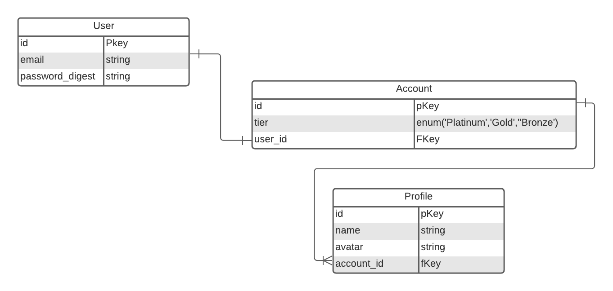

# Hackathon

## What We're Building

Your task is to build a Netflix clone, we'll call it Netflux... The core features should be:

- Creating A User
- A user has sole ownership of an account
- An account has many profiles
- You should be able to create many profiles for each account

A React app and `app.js` has been provided for you, for both the front end and back end. You'll need to install your own depedencies for the back end.

## Front End

The front end must have a minimum of 5 pages:

- Home page
- Log In
- Sign Up
- View Profiles
- Create Profile

## Back End

You don't have to implement a fully featured auth system. Fake auth is acceptable for MVP.

The back end requirements are as follows:

- Must use sequelize
- Must use express
- Must have a minimum of 3 models

Additional Requirements:

- Create a user
- Create an account
- Create a profile

## Post MVP Features

Here is a list of post mvp features that you can implement

- Integrate the `tmdb` api
- Ability to add and remove favorites from your list
- Ability to remove profiles from an account
- Integrate proper auth utilizing `jsonwebtoken` and `bcrypt`

## ERD

Here's an example erd:

## Profile Avatars

We'll provide you with a list of fun avatar icons that you can use for your project, if you make a `GET` request to this url:

`https://serene-woodland-97273.herokuapp.com/api/avatars`

You'll receive an array of images for your use.
